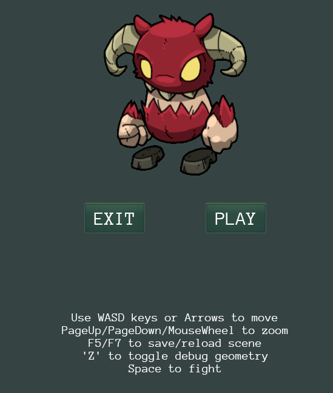
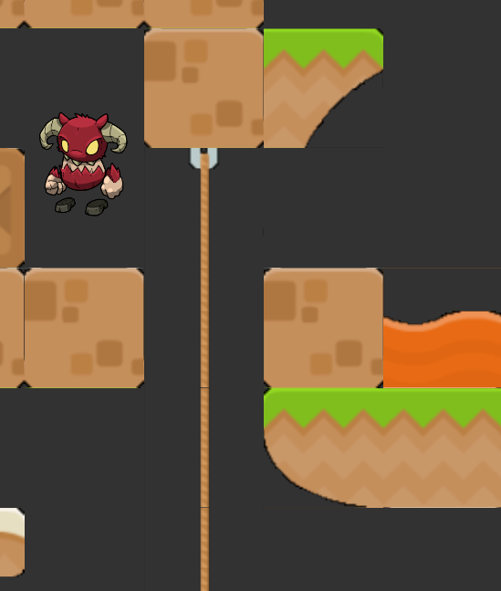

# Create a 2D game using the rbfx engine

A step-by-step guide on how to create a 2D game similar to [50_Urho2DPlatformer][50_Urho2DPlatformer].

## Requirements

You need to have installed:
- cmake
- a compiler (e.g. gcc/clang/msvc)
- git
- python

## Scaffold

You can build the rbfx engine from scratch, or use a prebuild version.
I will show how to build by downloading a prebuild version, but the same approach can be used when building rbfx from source.

### Get prebuilt rbfx

Create a folder that will contain your project, e.g. ```<myfolder>```.

Download one of the [rbfx releases][rbfx-releases]. For example, for my linux environment I downloaded ```rebelfork-sdk-linux-gcc-x64-dll-latest.7a``` and unpacked it into ```<myfolder>/rebelfork-sdk-linux-gcc-x64-dll-latest``` by running a command such as:

```
7za x rebelfork-sdk-linux-gcc-x64-dll-latest.7z
```

### Run cookiecutter

Install cookiecutter following [this][cookiecutter] documentation.
Then, from ```<myfolder>``` run:

```
cookiecutter https://github.com/frobino/cookiecutter-rbfx
```

And when prompted, press enter apart for the ```rbfx_sdk``` question where you should specify the relative path to the rbfx sdk:

```
  [1/5] project_name (Sample Project):
  [2/5] project_slug (sample-project):
  [3/5] rbfx_sdk (../rbfx): ../rebelfork-sdk-linux-gcc-x64-dll-latest
  [4/5] min_cmake_version (3.14):
  [5/5] license (MIT):
```

This will create a minimal application that starts the engine and show a dark screen.

```
├── CMakeLists.txt
├── Plugins
│   └── Core.SamplePlugin
│       ├── ...
├── Project
│   ├── Data
│   │   ├── Default.AssetPipeline.json
│   │   ├── Fonts
│   │   │   └── README.md
│   │   ├── Images
│   │   │   └── README.md
│   │   ├── Materials
│   │   │   └── README.md
│   │   ├── Scenes
│   │   │   └── README.md
│   │   ├── Sounds
│   │   │   └── README.md
│   │   ├── Textures
│   │   │   └── README.md
│   │   └── UI
│   │       └── README.md
│   └── Project.json
├── ResourceRoot.ini
└── Source
    ├── Application
    │   ├── CMakeLists.txt
    │   ├── SampleProject.cpp
    │   └── SampleProject.h
    └── Launcher
        ├── CMakeLists.txt
        └── Launcher.cpp
```

```Launcher```: the main entrypoint, initializes the engine parameters and register the plugins.

```Application```: the main plugin that will contain our game, but for now it just subscribes to the event KEYDOWN, so that when we press *esc* the engine exits.

```ResourceRoot.ini```: configures where the engine can be found, the path for project assets and non-code related files.

```Project/Data```: folder for project assets.

```Plugins```: subprojects generating shared libraries that extend the engine's functionality without requiring you to modify or recompile the core engine source code.

### Build and run

Your ```<myfolder>``` should now contain 2 subfolders:
- ```<myfolder>/rebelfork-sdk-linux-gcc-x64-dll-latest```
- ```<myfolder>/sample-project```

Go into ```<myfolder>/sample-project``` and build the game executable by running one of the commands below (depending on your setup):

Linux, dll:
```
cmake -DCMAKE_EXPORT_COMPILE_COMMANDS=ON -DBUILD_SHARED_LIBS=ON -DCMAKE_PREFIX_PATH=../rebelfork-sdk-linux-gcc-x64-dll-latest -S . -B ./build && cmake --build build/
```

Windows, dll:
```
cmake -DCMAKE_EXPORT_COMPILE_COMMANDS=ON -DBUILD_SHARED_LIBS=ON -DCMAKE_PREFIX_PATH="..\rebelfork-sdk-windows-msvc-x64-dll-latest" -DCMAKE_CONFIGURATION_TYPES="Debug;RelWithDebInfo" -S . -B ./build && cmake --build build/
```

If everything builds fine, you should be able to run the application:

```
./build/bin/sample-project
```

A black screen should appear, and you should be able to close it by pressing ESC.

Expected terminal output:

```
[16:20:59] [info] [main] : Resource root file is found and used: ~/Projects/rbfx/docs/sample-project/ResourceRoot.ini
[16:20:59] [error] [main] : Resource directory is not found: ~/Projects/rbfx/docs/sample-project/Project/Cache/
[16:20:59] [info] [main] : ConfigFile 'EngineParameters.json' is not found
[16:20:59] [info] [main] : ConfigFile overrides 'conf://EngineParameters.json' are loaded
[16:20:59] [debug] [main] : Initialising SDL
[16:20:59] [info] [main] : 0 plugins enabled
[16:20:59] [info] [main] : Loaded static plugin 'Builtin.SceneViewer'
[16:20:59] [info] [main] : Added dynamic plugin 'Automatic:Scripts'
[16:20:59] [info] [main] : Created 3 worker threads
[16:20:59] [info] [main] : [diligent] User-defined allocator is not provided. Using default allocator.
[16:20:59] [info] [main] : [diligent] Attached to OpenGL 4.5 context (4.5 (Core Profile) Mesa 25.0.7-2, llvmpipe (LLVM 19.1.7, 128 bits))
[16:20:59] [info] [main] : [diligent] GPU Vendor: mesa
[16:20:59] [info] [main] : [diligent] Disabling separable shader programs
[16:20:59] [info] [main] : RenderDevice is initialized for OpenGL: size=1706x846px (1706x846dp), color=TEX_FORMAT_RGBA8_UNORM_SRGB, depth=TEX_FORMAT_D24_UNORM_S8_UINT
[16:20:59] [info] [main] : Set screen mode: 1706x846 pixels at 60 Hz at monitor 0 [Borderless]
[16:20:59] [info] [main] : Initialized input
[16:20:59] [debug] [main] : Loading resource Techniques/NoTexture.xml
[16:20:59] [debug] [main] : Loading resource Textures/Ramp.png
[16:20:59] [debug] [main] : Loading temporary resource Textures/Ramp.xml
[16:20:59] [debug] [main] : Loading resource Textures/Spot.png
[16:20:59] [debug] [main] : Loading temporary resource Textures/Spot.xml
[16:20:59] [info] [main] : Initialized renderer
[16:20:59] [info] [main] : Set audio mode 44100 Hz 5.1 Surround interpolated
[16:20:59] [debug] [main] : Loading resource Shaders/GLSL/v2/X_ImGui.glsl
[16:20:59] [info] [main] : Initialized engine
[16:21:00] [info] [main] : Set audio mode 44100 Hz 5.1 Surround interpolated
[16:21:00] [trace] [main] : Window was moved to 0,0
[16:21:00] [info] [main] : [diligent] Resizing the swap chain to 1706x846
[16:21:00] [info] [main] : 2 plugins enabled: Plugin.Core.SamplePlugin;App.Main
[16:21:00] [info] [main] : Added dynamic plugin 'Plugin.Core.SamplePlugin'
[16:21:00] [debug] [main] : Plugin Plugin.Core.SamplePlugin version 1 is loaded from ~/Projects/rbfx/docs/sample-project/build/bin/libPlugin.Core.SamplePlugin.so
[16:21:00] [info] [main] : Added dynamic plugin 'App.Main'
[16:21:00] [debug] [main] : Plugin App.Main version 1 is loaded from ~/Projects/rbfx/docs/sample-project/build/bin/libApp.Main.so
[16:21:00] [info] [main] : Application is started with 2 plugins
```

### Get ready to code

Setup your editor for include path, autocompletion, etc.
For example, if you develop using vscode, the following configuration can be helpful:

*c_cpp_properties.json*:
```json
{
    "configurations": [
        {
            "name": "Linux",
            "includePath": [
                "${workspaceFolder}/**",
                "../rebelfork-sdk-linux-gcc-x64-dll-latest/include/**"
            ],
            "defines": [],
            "compilerPath": "/usr/bin/clang",
            "cStandard": "c17",
            "cppStandard": "c++17",
            "intelliSenseMode": "linux-clang-x64"
        }
    ],
    "version": 4
}
```

## Add startup menu

We will have to:
- create the StartUpMenu class
- add a *style* for the Menu
- hook StartUpMenu into SampleProject

Create *Source/Application/StartUpMenu.h*:
```cpp
#ifndef STARTUPMENU_H
#define STARTUPMENU_H

#include <Urho3D/Core/Object.h>

using namespace Urho3D;

class StartupMenu : public Object
{
    URHO3D_OBJECT(StartupMenu, Object);

public:
    StartupMenu(Context* context);

private:
    void CreateMenu();
    void HandleStartButton(StringHash eventType, VariantMap& eventData);
    void HandleExitButton(StringHash eventType, VariantMap& eventData);
};

#endif // STARTUPMENU_H
```

Create *Source/Application/StartUpMenu.cpp*:
```cpp
#include "StartupMenu.h"

#include <Urho3D/Core/Object.h>
#include <Urho3D/Resource/ResourceCache.h>
#include <Urho3D/UI/UI.h>
#include <Urho3D/UI/Window.h>
#include <Urho3D/UI/Button.h>
#include <Urho3D/UI/Text.h>
#include <Urho3D/Resource/XMLFile.h>
#include <Urho3D/IO/Log.h>
#include <Urho3D/UI/UIEvents.h>
#include <Urho3D/Input/Input.h>
#include <Urho3D/Graphics/Texture2D.h>
#include <Urho3D/UI/Font.h>

using namespace Urho3D;

StartupMenu::StartupMenu(Context* context) :
    Object(context)
{
    CreateMenu();
}

void StartupMenu::CreateMenu()
{
    auto* cache = GetSubsystem<ResourceCache>();
    auto* ui = GetSubsystem<UI>();

    // Set the default UI style and font
    ui->GetRoot()->SetDefaultStyle(cache->GetResource<XMLFile>("UI/DefaultStyle.xml"));
    auto* font = cache->GetResource<Font>("Fonts/Anonymous Pro.ttf");

    // Create the fullscreen UI for start/end
    auto* fullUI = ui->GetRoot()->CreateChild<Window>("FullUI");
    fullUI->SetStyleAuto();
    fullUI->SetSize(ui->GetRoot()->GetWidth(), ui->GetRoot()->GetHeight());
    fullUI->SetEnabled(false); // Do not react to input, only the 'Exit' and 'Play' buttons will

    // Create the title
    auto* title = fullUI->CreateChild<BorderImage>("Title");
    title->SetMinSize(fullUI->GetWidth(), 50);
    title->SetTexture(cache->GetResource<Texture2D>("Textures/HeightMap.png"));
    title->SetFullImageRect();
    title->SetAlignment(HA_CENTER, VA_TOP);
    auto* titleText = title->CreateChild<Text>("TitleText");
    titleText->SetAlignment(HA_CENTER, VA_CENTER);
    titleText->SetFont(font, 24);
    titleText->SetText("Frallan's Adventure");

    // Create the image
    auto* spriteUI = fullUI->CreateChild<BorderImage>("Sprite");
    spriteUI->SetTexture(cache->GetResource<Texture2D>("Urho2D/imp/imp_all.png"));
    spriteUI->SetSize(238, 271);
    spriteUI->SetAlignment(HA_CENTER, VA_CENTER);
    spriteUI->SetPosition(0, - ui->GetRoot()->GetHeight() / 4);

    // Create the 'EXIT' button
    auto* exitButton = ui->GetRoot()->CreateChild<Button>("ExitButton");
    exitButton->SetStyleAuto();
    exitButton->SetFocusMode(FM_RESETFOCUS);
    exitButton->SetSize(100, 50);
    exitButton->SetAlignment(HA_CENTER, VA_CENTER);
    exitButton->SetPosition(-100, 0);
    auto* exitText = exitButton->CreateChild<Text>("ExitText");
    exitText->SetAlignment(HA_CENTER, VA_CENTER);
    exitText->SetFont(font, 24);
    exitText->SetText("EXIT");
    SubscribeToEvent(exitButton, E_RELEASED, URHO3D_HANDLER(StartupMenu, HandleExitButton));

    // Create the 'PLAY' button
    auto* playButton = ui->GetRoot()->CreateChild<Button>("PlayButton");
    playButton->SetStyleAuto();
    playButton->SetFocusMode(FM_RESETFOCUS);
    playButton->SetSize(100, 50);
    playButton->SetAlignment(HA_CENTER, VA_CENTER);
    playButton->SetPosition(100, 0);
    auto* playText = playButton->CreateChild<Text>("PlayText");
    playText->SetAlignment(HA_CENTER, VA_CENTER);
    playText->SetFont(font, 24);
    playText->SetText("PLAY");
    SubscribeToEvent(playButton, E_RELEASED, URHO3D_HANDLER(StartupMenu, HandleStartButton));

    // Create the instructions
    auto* instructionText = ui->GetRoot()->CreateChild<Text>("Instructions");
    instructionText->SetText("Use WASD keys or Arrows to move\nPageUp/PageDown/MouseWheel to zoom\nF5/F7 to save/reload scene\n'Z' to toggle debug geometry\nSpace to fight");
    instructionText->SetFont(cache->GetResource<Font>("Fonts/Anonymous Pro.ttf"), 15);
    instructionText->SetTextAlignment(HA_CENTER); // Center rows in relation to each other
    instructionText->SetAlignment(HA_CENTER, VA_CENTER);
    instructionText->SetPosition(0, ui->GetRoot()->GetHeight() / 4);

    // Show mouse cursor
    auto* input = GetSubsystem<Input>();
    input->SetMouseVisible(true);
}

void StartupMenu::HandleStartButton(StringHash eventType, VariantMap& eventData)
{
    URHO3D_LOGINFO("Start Game button pressed");
}

void StartupMenu::HandleExitButton(StringHash eventType, VariantMap& eventData)
{
    URHO3D_LOGINFO("Exit Game button pressed");
}
```

Add a *style*, which include *textures* and *fonts*:

- Project/Data/UI/DefaultStyle.xml
- Project/Data/Textures/UI.xml
- Project/Data/Textures/UI.png
- Project/Data/Textures/HeightMap.png
- Project/Data/Fonts/Anonymous Pro.ttf

Add a picture to plot in the middle of the menu (will be our sprite):

- Project/Data/Urho2D/imp/imp_all.png

Hook the new class into *Source/Application/SampleProject.cpp*:

```diff
 #include "SampleProject.h"
+#include "StartupMenu.h"
 
 #include <Urho3D/Engine/Engine.h>
 #include <Urho3D/Input/InputEvents.h>
@@ -40,6 +41,10 @@ void SampleProject::Load()
 void SampleProject::Start(bool isMain)
 {
     SubscribeToEvent(E_KEYDOWN, URHO3D_HANDLER(SampleProject, HandleKeyDown));
+
+    // Create and start the StartupMenu
+    auto* startupMenu = new StartupMenu(context_);
+
 }
 
 void SampleProject::Stop()
```

This is how the menu will look like:



## Add platformer game

In this section we will:

- create Platformer class, representing the game to be started
- connect it to the menu, so it can start the game once the start button is pressed
- update the top level sample project, to create the game instance and pass it to the updated menu

Let's go:

- create Platformer class, representing the game to be started. Currently it just shows a grey scene.

Platformer.h:

```cpp
#pragma once

#include <Urho3D/Engine/StateManager.h>
#include <Urho3D/Scene/Scene.h>

using namespace Urho3D;
class Platformer : public ApplicationState
{
    URHO3D_OBJECT(Platformer, ApplicationState);

public:
    /// Construct.
    explicit Platformer(Context* context);
    /// Deconstruct.
    ~Platformer();

    SharedPtr<Scene> GetScene();

private:
    SharedPtr<Scene> scene_;
    void CreateScene();
    void HandleSceneRendered(StringHash eventType, VariantMap& eventData);
};
```

Platformer.cpp:

```cpp
#include "Platformer.h"

#include <Urho3D/Physics/PhysicsWorld.h>
#include <Urho3D/Graphics/Camera.h>
#include <Urho3D/Graphics/Octree.h>
#include <Urho3D/Graphics/Graphics.h>
#include <Urho3D/Graphics/Zone.h>
#include <Urho3D/Graphics/Renderer.h>
#include <Urho3D/Urho2D/Drawable2D.h> // PIXEL_SIZE
#include <Urho3D/Core/Object.h> // URHO3D_HANDLER
#include <Urho3D/Graphics/GraphicsEvents.h> // E_ENDRENDERING

Platformer::Platformer(Context* context) :
    ApplicationState(context)
{
    // Create the scene content
    CreateScene();
}

Platformer::~Platformer()
{
}

void Platformer::CreateScene()
{
    scene_ = new Scene(context_);
    scene_->CreateComponent<Octree>();
    scene_->CreateComponent<PhysicsWorld>();

    // Create camera
    Node* cameraNode = scene_->CreateChild("Camera");
    Camera* camera = cameraNode->CreateComponent<Camera>();
    camera->SetOrthographic(true);

    auto* graphics = GetSubsystem<Graphics>();
    camera->SetOrthoSize((float)graphics->GetHeight() * PIXEL_SIZE);
    camera->SetZoom(2.0f * Min((float)graphics->GetWidth() / 1280.0f, (float)graphics->GetHeight() / 800.0f)); // Set zoom according to user's resolution to ensure full visibility (initial zoom (2.0) is set for full visibility at 1280x800 resolution)

    // Setup the viewport for displaying the scene
    SharedPtr<Viewport> viewport(new Viewport(context_, scene_, camera));
    auto* renderer = GetSubsystem<Renderer>();
    renderer->SetViewport(0, viewport);

    // Set background color for the scene
    Zone* zone = renderer->GetDefaultZone();
    zone->SetFogColor(Color(0.2f, 0.2f, 0.2f));

    // Check when scene is rendered
    SubscribeToEvent(E_ENDRENDERING, URHO3D_HANDLER(Platformer, HandleSceneRendered));
}

void Platformer::HandleSceneRendered(StringHash eventType, VariantMap& eventData)
{
    UnsubscribeFromEvent(E_ENDRENDERING);
    // Pause the scene as long as the UI is hiding it
    scene_->SetUpdateEnabled(false);
}

SharedPtr<Scene> Platformer::GetScene(){
    return scene_;
}
```

- enable menu to spawn the game (platformer)

StartupMenu.h:

```diff
 #ifndef STARTUPMENU_H
 #define STARTUPMENU_H
 
+#include "Platformer.h"
+
 #include <Urho3D/Core/Object.h>
 
 using namespace Urho3D;
@@ -10,14 +12,13 @@ class StartupMenu : public Object
     URHO3D_OBJECT(StartupMenu, Object);
 
 public:
-    StartupMenu(Context* context);
+    StartupMenu(Context* context, Platformer* game);
 
 private:
     void CreateUIContent();
     void HandleStartButton(StringHash eventType, VariantMap& eventData);
     void HandleExitButton(StringHash eventType, VariantMap& eventData);
+    Platformer* game_;
 };
 
 #endif // STARTUPMENU_H
```

StartupMenu.cpp:

```diff
-StartupMenu::StartupMenu(Context* context) :
-    Object(context)
+StartupMenu::StartupMenu(Context* context, Platformer* game) :
+    Object(context), game_(game)
 {
     // CreateMenu();
     CreateUIContent();
 }
 
 void StartupMenu::CreateUIContent()
@@ -99,6 +100,29 @@ void StartupMenu::CreateUIContent()
 void StartupMenu::HandleStartButton(StringHash eventType, VariantMap& eventData)
 {
     URHO3D_LOGINFO("Start Game button pressed");
+
+    // Remove fullscreen UI and unfreeze the scene
+    auto* ui = GetSubsystem<UI>();
+    if (static_cast<Text*>(ui->GetRoot()->GetChild("FullUI", true)))
+    {
+        ui->GetRoot()->GetChild("FullUI", true)->Remove();
+        URHO3D_LOGINFO("Enable scene...");
+        game_->GetScene()->SetUpdateEnabled(true);
+    }
+
+    // Hide Instructions and Play/Exit buttons
+    Text* instructionText = static_cast<Text*>(ui->GetRoot()->GetChild("Instructions", true));
+    instructionText->SetText("");
+    Button* exitButton = static_cast<Button*>(ui->GetRoot()->GetChild("ExitButton", true));
+    exitButton->SetVisible(false);
+    Button* playButton = static_cast<Button*>(ui->GetRoot()->GetChild("PlayButton", true));
+    playButton->SetVisible(false);
+
+    // Hide mouse cursor
+    auto* input = GetSubsystem<Input>();
+    input->SetMouseVisible(false);
```

- update the top level project to create a game (Platformer) instance and pass it to the (updated) menu instance

SampleProject.h:

```diff
+ include "Platformer.h"

 private:
     void HandleKeyDown(StringHash eventType, VariantMap& eventData);
+    SharedPtr<Platformer> game_;
 
 };
```

SampleProject.cpp:

```diff
@@ -41,8 +41,12 @@ void SampleProject::Start(bool isMain)
 {
     SubscribeToEvent(E_KEYDOWN, URHO3D_HANDLER(SampleProject, HandleKeyDown));
 
+    // Create and start the game
+    game_ = MakeShared<Platformer>(context_);
+
     // Create and start the StartupMenu
-    startupMenu_ = new StartupMenu(context_);
+    startupMenu_ = new StartupMenu(context_, game_);
 
 }
```

## Map: create tileMap (tmx file) with tiled

Add the following files to your project:

- Project/Data/Urho2D/Tilesets/Ortho.png
- Project/Data/Urho2D/Tilesets/Ortho.tmx

The Ortho.tmx file is the *tilemap*.
It uses the *tilesets* components (inide Ortho.png) to create the map + layers etc.
Tilemaps can be opened and edited in [Tiled](https://github.com/mapeditor/tiled/releases).

## Map: import tileMap in the game scene and center the camera

Platformer.cpp:

```diff
Platformer::Platformer(Context* context) :
     ApplicationState(context)
@@ -39,12 +42,28 @@ void Platformer::CreateScene()
     // Setup the viewport for displaying the scene
     SharedPtr<Viewport> viewport(new Viewport(context_, scene_, camera));
     auto* renderer = GetSubsystem<Renderer>();
     renderer->SetViewport(0, viewport);
 
     // Set background color for the scene
     Zone* zone = renderer->GetDefaultZone();
     zone->SetFogColor(Color(0.2f, 0.2f, 0.2f));
 
+    // Create tile map from tmx file
+    auto* cache = GetSubsystem<ResourceCache>();
+    TmxFile2D* tmxFile = cache->GetResource<TmxFile2D>("Urho2D/Tilesets/Ortho.tmx");
+    if (!tmxFile) {
+        URHO3D_LOGERROR("Failed to load TMX file!");
+        return;
+    }
+    // Create a node for the tile map
+    SharedPtr<Node> tileMapNode(scene_->CreateChild("TileMap"));
+    auto* tileMap = tileMapNode->CreateComponent<TileMap2D>();
+    tileMap->SetTmxFile(tmxFile);
+
+    // Center the camera at the center of the tilemap (see 50, 50 multiplication factors below)
+    const TileMapInfo2D& info = tileMap->GetInfo();
+    cameraNode->SetPosition(Vector3(info.GetMapWidth() * PIXEL_SIZE * 50, info.GetMapHeight() * PIXEL_SIZE * 50, -1.0f));
+
     // Check when scene is rendered
     SubscribeToEvent(E_ENDRENDERING, URHO3D_HANDLER(Platformer, HandleSceneRendered));
 }
```

**MILESTONE**: you can see the map to be played instead of the grey background!

## Spriter Imp character: create

Create the sprite.
In rbfx/u3d sprites are in scml format, where the scml file include the components (pngs) and describe how to animate the sprite by moving the components.

Add to the project:

- Project/Data/Urho2D/imp/imp.scml
- Project/Data/Urho2D/imp/imp_body.png
- Project/Data/Urho2D/imp/imp_footsmall.png
- Project/Data/Urho2D/imp/imp_handsmall.png
- Project/Data/Urho2D/imp/imp_headangry.png
- Project/Data/Urho2D/imp/imp_head.png
- Project/Data/Urho2D/imp/imp_blood.png
- Project/Data/Urho2D/imp/imp_footbig.png
- Project/Data/Urho2D/imp/imp_handbig.png
- Project/Data/Urho2D/imp/imp_handthrow.png
- Project/Data/Urho2D/imp/imp_headblink.png

What we have added is a sprite that can be visualized, edited and refined using [Spriter][spriter].

## Spriter Imp character:

Import the imp sprite in the game:

Platformer.h:

```diff
private:
     SharedPtr<Scene> scene_;
     void CreateScene();
+    Node* CreateCharacter(const TileMapInfo2D& info, float friction, const Vector3& position, float scale);
     void HandleSceneRendered(StringHash eventType, VariantMap& eventData);
 };
```

Platformer.cpp:

```diff
@@ -59,15 +63,34 @@ void Platformer::CreateScene()
     SharedPtr<Node> tileMapNode(scene_->CreateChild("TileMap"));
     auto* tileMap = tileMapNode->CreateComponent<TileMap2D>();
     tileMap->SetTmxFile(tmxFile);
+    const TileMapInfo2D& info = tileMap->GetInfo();
+
+    // Create Spriter Imp character (from sample 33_SpriterAnimation)
+    Node* spriteNode = CreateCharacter(info, 0.8f, Vector3(info.GetMapWidth() * PIXEL_SIZE * 46, info.GetMapHeight() * PIXEL_SIZE * 55, 0.0f), 0.2f);
 
     // Center the camera at the center of the tilemap (see 50, 50 multiplication factors below)
-    const TileMapInfo2D& info = tileMap->GetInfo();
     cameraNode->SetPosition(Vector3(info.GetMapWidth() * PIXEL_SIZE * 50, info.GetMapHeight() * PIXEL_SIZE * 50, -1.0f));
 
     // Check when scene is rendered
     SubscribeToEvent(E_ENDRENDERING, URHO3D_HANDLER(Platformer, HandleSceneRendered));
 }
 
+Node* Platformer::CreateCharacter(const TileMapInfo2D& info, float friction, const Vector3& position, float scale)
+{
+    auto* cache = GetSubsystem<ResourceCache>();
+    Node* spriteNode = scene_->CreateChild("Imp");
+    spriteNode->SetPosition(position);
+    spriteNode->SetScale(scale);
+    auto* animatedSprite = spriteNode->CreateComponent<AnimatedSprite2D>();
+    // Get scml file and Play "idle" anim
+    auto* animationSet = cache->GetResource<AnimationSet2D>("Urho2D/imp/imp.scml");
+    animatedSprite->SetAnimationSet(animationSet);
+    animatedSprite->SetAnimation("idle");
+    animatedSprite->SetLayer(3); // Put character over tile map (which is on layer 0) and over Orcs (which are on layer 2)
+
+    return spriteNode;
+}
+
 void Platformer::HandleSceneRendered(StringHash eventType, VariantMap& eventData)
 {
     UnsubscribeFromEvent(E_ENDRENDERING);
```

The sprite will be imported in the scene and you can see it "flying" in the middle of the screen.



## Spriter Imp character: add physics

In this section we will start adding physics to the sprite we added.
We will add physics to the sprite only, so after the our modification it will react to physics (start falling dowm) but it will not react to the map objects. This is because the map object has no physics yet.

- Adding physics to the sprite:

Platformer.cpp:

```diff
@@ -87,7 +87,14 @@ Node* Platformer::CreateCharacter(const TileMapInfo2D& info, float friction, con
     animatedSprite->SetAnimationSet(animationSet);
     animatedSprite->SetAnimation("idle");
     animatedSprite->SetLayer(3); // Put character over tile map (which is on layer 0) and over Orcs (which are on layer 2)
-
+    // Add physics
+    auto* impBody = spriteNode->CreateComponent<RigidBody2D>();
+    impBody->SetBodyType(BT_DYNAMIC);
+    impBody->SetAllowSleep(false);
+    auto* shape = spriteNode->CreateComponent<CollisionCircle2D>();
+    shape->SetRadius(1.1f); // Set shape size
+    shape->SetFriction(friction); // Set friction
+    shape->SetRestitution(0.1f); // Bounce
     return spriteNode;
 }
```

After rebuilding and starting the game, you should see the sprite falling down.

## Map: add physics (so Imp interacts with map, e.g. collide)

In this section we will generate physics collision shapes from the tmx file's objects located in "Physics" (top) layer. This is equivalent to give physics to the objects of the map.

After the changes, the Imp should collide with the map objects and NOT fall down.

Platformer.h:
```diff
 class Platformer : public ApplicationState
@@ -21,5 +25,10 @@ private:
     SharedPtr<Scene> scene_;
     void CreateScene();
     Node* CreateCharacter(const TileMapInfo2D& info, float friction, const Vector3& position, float scale);
+    void CreateCollisionShapesFromTMXObjects(Node* tileMapNode, TileMapLayer2D* tileMapLayer, const TileMapInfo2D& info);
+    CollisionBox2D* CreateRectangleShape(Node* node, TileMapObject2D* object, const Vector2& size, const TileMapInfo2D& info);
+    CollisionCircle2D* CreateCircleShape(Node* node, TileMapObject2D* object, float radius, const TileMapInfo2D& info);
+    CollisionPolygon2D* CreatePolygonShape(Node* node, TileMapObject2D* object);
+    CollisionChain2D* CreatePolyLineShape(Node* node, TileMapObject2D* object);
     void HandleSceneRendered(StringHash eventType, VariantMap& eventData);
 };
```

Platformer.cpp:
```diff
 Platformer::Platformer(Context* context) :
     ApplicationState(context)
@@ -64,6 +65,9 @@ void Platformer::CreateScene()
     auto* tileMap = tileMapNode->CreateComponent<TileMap2D>();
     tileMap->SetTmxFile(tmxFile);
     const TileMapInfo2D& info = tileMap->GetInfo();
+    // Generate physics collision shapes from the tmx file's objects located in "Physics" (top) layer
+    TileMapLayer2D* tileMapLayer = tileMap->GetLayer(tileMap->GetNumLayers() - 1);
+    CreateCollisionShapesFromTMXObjects(tileMapNode, tileMapLayer, info);
 
     // Create Spriter Imp character (from sample 33_SpriterAnimation)
     Node* spriteNode = CreateCharacter(info, 0.8f, Vector3(info.GetMapWidth() * PIXEL_SIZE * 46, info.GetMapHeight() * PIXEL_SIZE * 55, 0.0f), 0.2f);
@@ -98,6 +102,108 @@ Node* Platformer::CreateCharacter(const TileMapInfo2D& info, float friction, con
     return spriteNode;
 }
 
+void Platformer::CreateCollisionShapesFromTMXObjects(Node* tileMapNode, TileMapLayer2D* tileMapLayer, const TileMapInfo2D& info)
+{
+    // Create rigid body to the root node
+    auto* body = tileMapNode->CreateComponent<RigidBody2D>();
+    body->SetBodyType(BT_STATIC);
+
+    // Generate physics collision shapes and rigid bodies from the tmx file's objects located in "Physics" layer
+    for (unsigned i = 0; i < tileMapLayer->GetNumObjects(); ++i)
+    {
+        TileMapObject2D* tileMapObject = tileMapLayer->GetObject(i); // Get physics objects
+
+        // Create collision shape from tmx object
+        switch (tileMapObject->GetObjectType())
+        {
+            case OT_RECTANGLE:
+            {
+                CreateRectangleShape(tileMapNode, tileMapObject, tileMapObject->GetSize(), info);
+            }
+            break;
+
+            case OT_ELLIPSE:
+            {
+                CreateCircleShape(tileMapNode, tileMapObject, tileMapObject->GetSize().x_ / 2, info); // Ellipse is built as a Circle shape as it doesn't exist in Box2D
+            }
+            break;
+
+            case OT_POLYGON:
+            {
+                CreatePolygonShape(tileMapNode, tileMapObject);
+            }
+            break;
+
+            case OT_POLYLINE:
+            {
+                CreatePolyLineShape(tileMapNode, tileMapObject);
+            }
+            break;
+        }
+    }
+}
+
+CollisionBox2D* Platformer::CreateRectangleShape(Node* node, TileMapObject2D* object, const Vector2& size, const TileMapInfo2D& info)
+{
+    auto* shape = node->CreateComponent<CollisionBox2D>();
+    shape->SetSize(size);
+    if (info.orientation_ == O_ORTHOGONAL)
+        shape->SetCenter(object->GetPosition() + size / 2);
+    else
+    {
+        shape->SetCenter(object->GetPosition() + Vector2(info.tileWidth_ / 2, 0.0f));
+        shape->SetAngle(45.0f); // If our tile map is isometric then shape is losange
+    }
+    shape->SetFriction(0.8f);
+    if (object->HasProperty("Friction"))
+        shape->SetFriction(ToFloat(object->GetProperty("Friction")));
+    return shape;
+}
+
+CollisionCircle2D* Platformer::CreateCircleShape(Node* node, TileMapObject2D* object, float radius, const TileMapInfo2D& info)
+{
+    auto* shape = node->CreateComponent<CollisionCircle2D>();
+    Vector2 size = object->GetSize();
+    if (info.orientation_ == O_ORTHOGONAL)
+        shape->SetCenter(object->GetPosition() + size / 2);
+    else
+    {
+        shape->SetCenter(object->GetPosition() + Vector2(info.tileWidth_ / 2, 0.0f));
+    }
+
+    shape->SetRadius(radius);
+    shape->SetFriction(0.8f);
+    if (object->HasProperty("Friction"))
+        shape->SetFriction(ToFloat(object->GetProperty("Friction")));
+    return shape;
+}
+
+CollisionPolygon2D* Platformer::CreatePolygonShape(Node* node, TileMapObject2D* object)
+{
+    auto* shape = node->CreateComponent<CollisionPolygon2D>();
+    int numVertices = object->GetNumPoints();
+    shape->SetVertexCount(numVertices);
+    for (int i = 0; i < numVertices; ++i)
+        shape->SetVertex(i, object->GetPoint(i));
+    shape->SetFriction(0.8f);
+    if (object->HasProperty("Friction"))
+        shape->SetFriction(ToFloat(object->GetProperty("Friction")));
+    return shape;
+}
+
+CollisionChain2D* Platformer::CreatePolyLineShape(Node* node, TileMapObject2D* object)
+{
+    auto* shape = node->CreateComponent<CollisionChain2D>();
+    int numVertices = object->GetNumPoints();
+    shape->SetVertexCount(numVertices);
+    for (int i = 0; i < numVertices; ++i)
+        shape->SetVertex(i, object->GetPoint(i));
+    shape->SetFriction(0.8f);
+    if (object->HasProperty("Friction"))
+        shape->SetFriction(ToFloat(object->GetProperty("Friction")));
+    return shape;
+}
+
```
After rebuilding and starting the game, you should see the sprite nicely landing on a platform and NOT fall.

## Spriter Imp character: move

In this section we will enable the sprite to move when using the WASD or directional keys.

Add the following files:
- Character.cpp
- Character.h

Character.cpp:

```cpp
#include <Urho3D/Core/Context.h>
#include <Urho3D/Input/Input.h>
#include <Urho3D/Scene/Node.h>

#include "Character.h"

Character::Character(Context* context) :
    LogicComponent(context)
{
}

void Character::RegisterObject(Context* context)
{
    context->RegisterFactory<Character>();
}

void Character::Update(float timeStep)
{
    auto* input = GetSubsystem<Input>();
    Vector2 moveDir = Vector2::ZERO; // Reset
    URHO3D_LOGINFO("Character updated");

    // Set direction
    if (input->GetKeyDown(KEY_A) || input->GetKeyDown(KEY_LEFT))
    {
        URHO3D_LOGINFO("Left button pressed");
        moveDir = moveDir + Vector2::LEFT;
    }
    if (input->GetKeyDown(KEY_D) || input->GetKeyDown(KEY_RIGHT))
    {
        URHO3D_LOGINFO("Right button pressed");
        moveDir = moveDir + Vector2::RIGHT;
    }

    // Move
    if (moveDir != Vector2::ZERO)
    {
        GetNode()->Translate(Vector3(moveDir.x_, moveDir.y_, 0) * timeStep * 1.8f);
    }
}
```

Character.h:
```cpp
#pragma once

#include <Urho3D/Scene/LogicComponent.h>

using namespace Urho3D;

class Character : public LogicComponent
{
    URHO3D_OBJECT(Character, LogicComponent);

public:
    /// Construct.
    explicit Character(Context* context);

    /// Register object factory and attributes.
    static void RegisterObject(Context* context);

    /// Handle update. Called by LogicComponent base class.
    void Update(float timeStep) override;
};
```

Modify Platformer.cpp:
```diff
 #include "Platformer.h"
+#include "Character.h"
 
 #include <Urho3D/Physics/PhysicsWorld.h>
 #include <Urho3D/Graphics/Camera.h>
@@ -21,6 +22,9 @@
 Platformer::Platformer(Context* context) :
     ApplicationState(context)
 {
+    // Register the Character component
+    Character::RegisterObject(context);
+
     // Create the scene content
     CreateScene();
 }
@@ -99,6 +103,8 @@ Node* Platformer::CreateCharacter(const TileMapInfo2D& info, float friction, con
     shape->SetRadius(1.1f); // Set shape size
     shape->SetFriction(friction); // Set friction
     shape->SetRestitution(0.1f); // Bounce
+    // Add the "intelligence" to the sprite (e.g. what to do with it when keys are pressed)
+    spriteNode->CreateComponent<Character>();
     return spriteNode;
 }
```

Rebuild and start the game and try to move the sprite.

## Spriter Imp character: jump

Enable the sprite to jump.

Character.cpp:
```diff
+#include <Urho3D/Physics2D/RigidBody2D.h>
 
 #include "Character.h"
 
@@ -40,7 +41,6 @@ void Character::Update(float timeStep)
 {
     auto* input = GetSubsystem<Input>();
     Vector2 moveDir = Vector2::ZERO; // Reset
-    URHO3D_LOGINFO("Character updated");
 
     // Set direction
     if (input->GetKeyDown(KEY_A) || input->GetKeyDown(KEY_LEFT))
@@ -54,6 +54,14 @@ void Character::Update(float timeStep)
         moveDir = moveDir + Vector2::RIGHT;
     }
 
+    // Jump
+    auto* body = GetComponent<RigidBody2D>();
+    if ((input->GetKeyDown(KEY_W) || input->GetKeyDown(KEY_UP)) && body->GetLinearVelocity().y_ == 0.0f)
+    {
+        URHO3D_LOGINFO("Jump button pressed");
+        body->ApplyLinearImpulse(Vector2(0.0f, 0.17f) * MOVE_SPEED, body->GetMassCenter(), true);
+    }
+
     // Move
     if (moveDir != Vector2::ZERO)
     {
```

Character.h:
```diff
 {
     URHO3D_OBJECT(Character, LogicComponent);
 
+    const float MOVE_SPEED = 23.0f;
+
 public:
     /// Construct.
     explicit Character(Context* context);
```

## Camera: follows the imp character

Make the camera follow the character.

Platformer.cpp:
```diff
@@ -79,6 +79,9 @@ void Platformer::CreateScene()
     // Center the camera at the center of the tilemap (see 50, 50 multiplication factors below)
     cameraNode->SetPosition(Vector3(info.GetMapWidth() * PIXEL_SIZE * 50, info.GetMapHeight() * PIXEL_SIZE * 50, -1.0f));
 
+    // Make the camera follow the character
+    cameraNode->SetParent(spriteNode);
+
     // Check when scene is rendered
     SubscribeToEvent(E_ENDRENDERING, URHO3D_HANDLER(Platformer, HandleSceneRendered));
 }

```

## Spriter Imp character: add animations when it moves

Run animations when the sprite is moving.

Plarformer.cpp:
```diff
 #include <Urho3D/Input/Input.h>
 #include <Urho3D/Scene/Node.h>
 #include <Urho3D/Physics2D/RigidBody2D.h>
+#include <Urho3D/Urho2D/AnimatedSprite2D.h>
 
 #include "Character.h"
 
@@ -42,16 +43,19 @@ void Character::Update(float timeStep)
     auto* input = GetSubsystem<Input>();
     Vector2 moveDir = Vector2::ZERO; // Reset
 
+    auto* animatedSprite = GetComponent<AnimatedSprite2D>();
     // Set direction
     if (input->GetKeyDown(KEY_A) || input->GetKeyDown(KEY_LEFT))
     {
         URHO3D_LOGINFO("Left button pressed");
         moveDir = moveDir + Vector2::LEFT;
+        animatedSprite->SetFlipX(false); // Flip the sprite to face left
     }
     if (input->GetKeyDown(KEY_D) || input->GetKeyDown(KEY_RIGHT))
     {
         URHO3D_LOGINFO("Right button pressed");
         moveDir = moveDir + Vector2::RIGHT;
+        animatedSprite->SetFlipX(true); // Flip the sprite to face right
     }
 
     // Jump
@@ -67,4 +71,23 @@ void Character::Update(float timeStep)
     {
         GetNode()->Translate(Vector3(moveDir.x_, moveDir.y_, 0) * timeStep * 1.8f);
     }
+
+    // Animate
+    if (input->GetKeyDown(KEY_SPACE))
+    {
+        if (animatedSprite->GetAnimation() != "attack")
+        {
+            animatedSprite->SetAnimation("attack", LM_FORCE_LOOPED);
+            animatedSprite->SetSpeed(1.5f);
+        }
+    }
+    else if (!moveDir.Equals(Vector2::ZERO))
+    {
+        if (animatedSprite->GetAnimation() != "run")
+            animatedSprite->SetAnimation("run");
+    }
+    else if (animatedSprite->GetAnimation() != "idle")
+    {
+        animatedSprite->SetAnimation("idle");
+    }
 }
```

#  Spriter imp character interact with map elements (lava)

Add:
- Project/Data/Sounds/BigExplosion.wav

Character.h:
```diff
     /// Handle update. Called by LogicComponent base class.
     void Update(float timeStep) override;
+
+    /// Flag when player is wounded.
+    bool wounded_;
 };
 ```

Platformer.cpp:
```diff
 #include <Urho3D/Physics2D/RigidBody2D.h>
+// Needed for collision detection
+#include <Urho3D/Physics2D/PhysicsEvents2D.h>
 // Needed for Map:
 #include <Urho3D/Urho2D/TileMapLayer2D.h>
+// Needed for collisionHandlers
+#include <Urho3D/Urho2D/ParticleEmitter2D.h>
+#include <Urho3D/Urho2D/ParticleEffect2D.h>
+#include <Urho3D/Audio/SoundSource.h>
+#include <Urho3D/Audio/Sound.h>
 
 Platformer::Platformer(Context* context) :
     ApplicationState(context)
@@ -75,6 +82,7 @@ void Platformer::CreateScene()
 
     // Create Spriter Imp character (from sample 33_SpriterAnimation)
     Node* spriteNode = CreateCharacter(info, 0.8f, Vector3(info.GetMapWidth() * PIXEL_SIZE * 46, info.GetMapHeight() * PIXEL_SIZE * 55, 0.0f), 0.2f);
+    character_ = spriteNode->CreateComponent<Character>(); // Create a logic component to handle character behavior
 
     // Center the camera at the center of the tilemap (see 50, 50 multiplication factors below)
     cameraNode->SetPosition(Vector3(info.GetMapWidth() * PIXEL_SIZE * 50, info.GetMapHeight() * PIXEL_SIZE * 50, -1.0f));
@@ -82,8 +90,14 @@ void Platformer::CreateScene()
     // Make the camera follow the character
     cameraNode->SetParent(spriteNode);
 
+    // Instantiate triggers (for ropes, ladders, lava, slopes...) at each placeholder of "Triggers" layer (placeholders for triggers are Rectangle objects).
+    // This enables to trigger collisions with elements of the tilemap (for ropes, ladders, lava, slopes...)
+    PopulateTriggers(tileMap->GetLayer(tileMap->GetNumLayers() - 4));
+
     // Check when scene is rendered
     SubscribeToEvent(E_ENDRENDERING, URHO3D_HANDLER(Platformer, HandleSceneRendered));
+    // Subscribe to Box2D contact listeners
+    SubscribeToEvent(E_PHYSICSBEGINCONTACT2D, URHO3D_HANDLER(Platformer, HandleCollisionBegin));
 }
 
 /// Create the character node at the position given and will set its scale to the given scale.
@@ -235,6 +249,85 @@ void Platformer::HandleSceneRendered(StringHash eventType, VariantMap& eventData
     scene_->SetUpdateEnabled(false);
 }
 
+void Platformer::HandleCollisionBegin(StringHash eventType, VariantMap& eventData)
+{
+    // Get colliding node
+    auto* hitNode = static_cast<Node*>(eventData[PhysicsBeginContact2D::P_NODEA].GetPtr());
+    if (hitNode->GetName() == "Imp")
+        hitNode = static_cast<Node*>(eventData[PhysicsBeginContact2D::P_NODEB].GetPtr());
+    ea::string hitNodeName = hitNode->GetName();
+
+    // Get main character node (Imp, from the imp.scml brushmonkey file)
+    Node* characterNode = scene_->GetChild("Imp", true);
+
+    URHO3D_LOGINFO("Collision begin " + hitNodeName);
+
+    // Handle falling into lava
+    if (hitNodeName == "Lava")
+    {
+        URHO3D_LOGINFO("Fall into lava");
+        auto* body = characterNode->GetComponent<RigidBody2D>();
+        body->ApplyForceToCenter(Vector2(0.0f, 100.0f), true);
+        if (!characterNode->GetChild("Emitter", true))
+        {
+            character_->wounded_ = true;
+            SpawnEffect(characterNode);
+            PlaySoundEffect("BigExplosion.wav");
+        }
+    }
+}
+
 SharedPtr<Scene> Platformer::GetScene(){
     return scene_;
+}
+
+void Platformer::SpawnEffect(Node* node)
+{
+    auto* cache = GetSubsystem<ResourceCache>();
+    Node* particleNode = node->CreateChild("Emitter");
+    particleNode->SetScale(0.5f / node->GetScale().x_);
+    auto* particleEmitter = particleNode->CreateComponent<ParticleEmitter2D>();
+    particleEmitter->SetLayer(2);
+    particleEmitter->SetEffect(cache->GetResource<ParticleEffect2D>("Urho2D/sun.pex"));
+}
+
+void Platformer::PlaySoundEffect(const ea::string& soundName)
+{
+    auto* cache = GetSubsystem<ResourceCache>();
+    auto* source = scene_->CreateComponent<SoundSource>();
+    auto* sound = cache->GetResource<Sound>("Sounds/" + soundName);
+    if (sound != nullptr) {
+        source->SetAutoRemoveMode(REMOVE_COMPONENT);
+        source->Play(sound);
+    }
+}
+
+void Platformer::PopulateTriggers(TileMapLayer2D* triggersLayer)
+{
+    // Create trigger node (will be cloned at each placeholder)
+    Node* triggerNode = CreateTrigger();
+
+    // Instantiate triggers at each placeholder (Rectangle objects)
+    for (unsigned i=0; i < triggersLayer->GetNumObjects(); ++i)
+    {
+        TileMapObject2D* triggerObject = triggersLayer->GetObject(i); // Get placeholder object
+        if (triggerObject->GetObjectType() == OT_RECTANGLE)
+        {
+            Node* triggerClone = triggerNode->Clone();
+            triggerClone->SetName(triggerObject->GetType());
+            auto* shape = triggerClone->GetComponent<CollisionBox2D>();
+            shape->SetSize(triggerObject->GetSize());
+            triggerClone->SetPosition2D(triggerObject->GetPosition() + triggerObject->GetSize() / 2);
+        }
+    }
+}
+
+Node* Platformer::CreateTrigger()
+{
+    Node* node = scene_->CreateChild(); // Clones will be renamed according to object type
+    auto* body = node->CreateComponent<RigidBody2D>();
+    body->SetBodyType(BT_STATIC);
+    auto* shape = node->CreateComponent<CollisionBox2D>(); // Create box shape
+    shape->SetTrigger(true);
+    return node;
 }
```

Platformer.h:
```diff
+#include "Character.h"
+
 using namespace Urho3D;
 class Platformer : public ApplicationState
 {
@@ -23,6 +25,9 @@ public:
 
 private:
     SharedPtr<Scene> scene_;
+    /// The controllable character component.
+    WeakPtr<Character> character_;
+
     void CreateScene();
     Node* CreateCharacter(const TileMapInfo2D& info, float friction, const Vector3& position, float scale);
     void CreateCollisionShapesFromTMXObjects(Node* tileMapNode, TileMapLayer2D* tileMapLayer, const TileMapInfo2D& info);
@@ -31,4 +36,9 @@ private:
     CollisionPolygon2D* CreatePolygonShape(Node* node, TileMapObject2D* object);
     CollisionChain2D* CreatePolyLineShape(Node* node, TileMapObject2D* object);
     void HandleSceneRendered(StringHash eventType, VariantMap& eventData);
+    void HandleCollisionBegin(StringHash eventType, VariantMap& eventData);
+    void PopulateTriggers(TileMapLayer2D* triggersLayer);
+    Node* CreateTrigger();
+    void SpawnEffect(Node* node);
+    void PlaySoundEffect(const ea::string& soundName);
 };
```

## Next steps: TBD

- Spriter Imp character: interact with map elements (stairs, ropes, lava, etc)
  - lava: see wounded_ and into Urho2DPlatformer::HandleCollisionBegin
- Spriter Orc: create + instantiate in map
- Spriter Orc: add physics
- Map: add physics (so Spriter Orc interacts with map, e.g. collide)
- Spriter Orc: give pattern to move
- Spriter Orc: add animations when it moves
- Orc + Imp: collision

[darkdove]:https://darkdove.proboards.com/thread/30/urho-flow-1
[50_Urho2DPlatformer]:https://github.com/rbfx/rbfx/tree/master/Source/Samples/50_Urho2DPlatformer
[rbfx-releases]:https://github.com/rbfx/rbfx/releases
[cookiecutter]:https://cookiecutter.readthedocs.io/en/stable/installation.html
[spriter]:https://brashmonkey.com/
